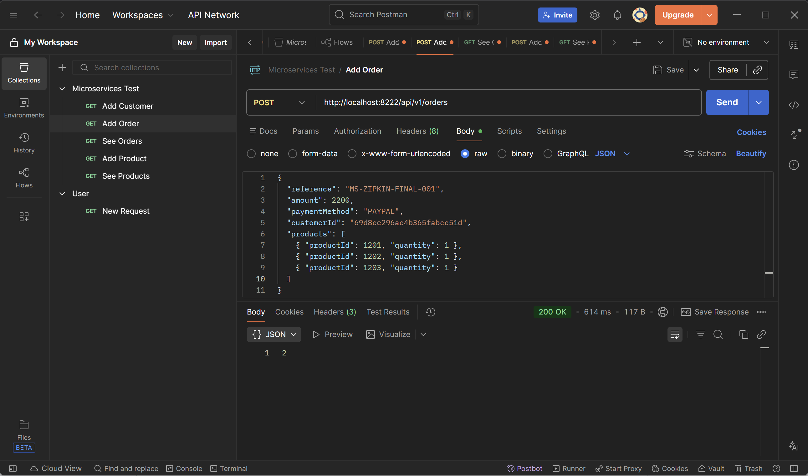
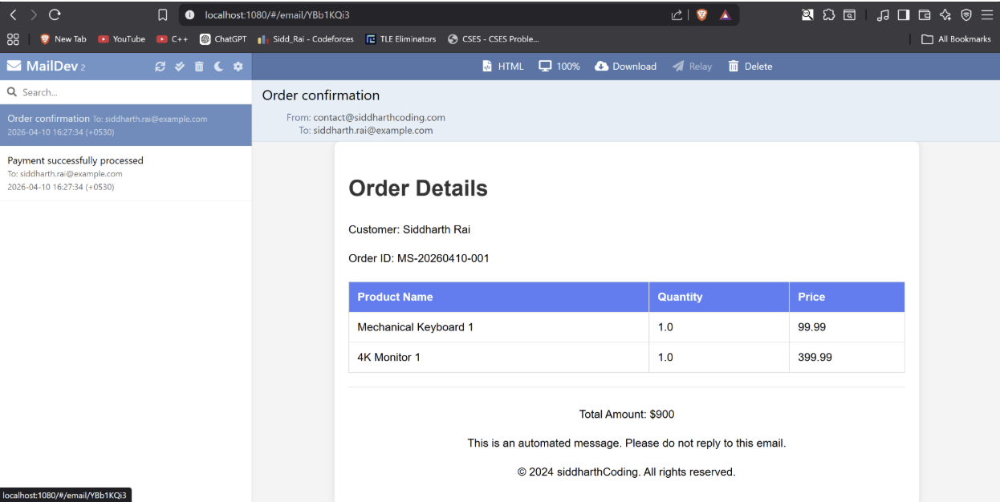
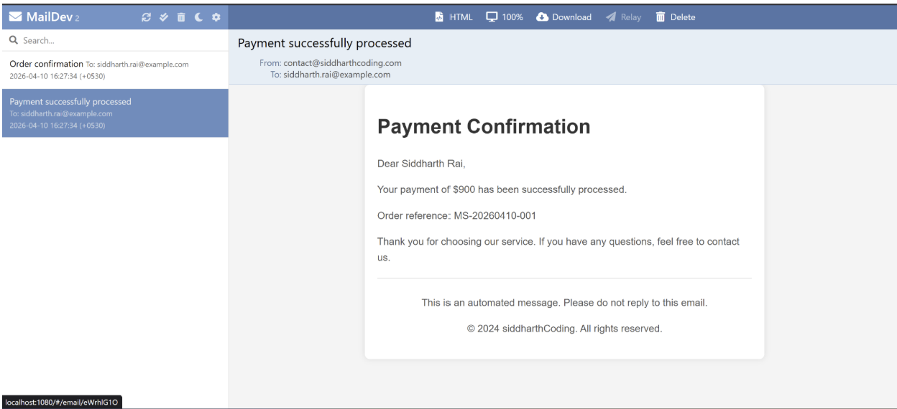
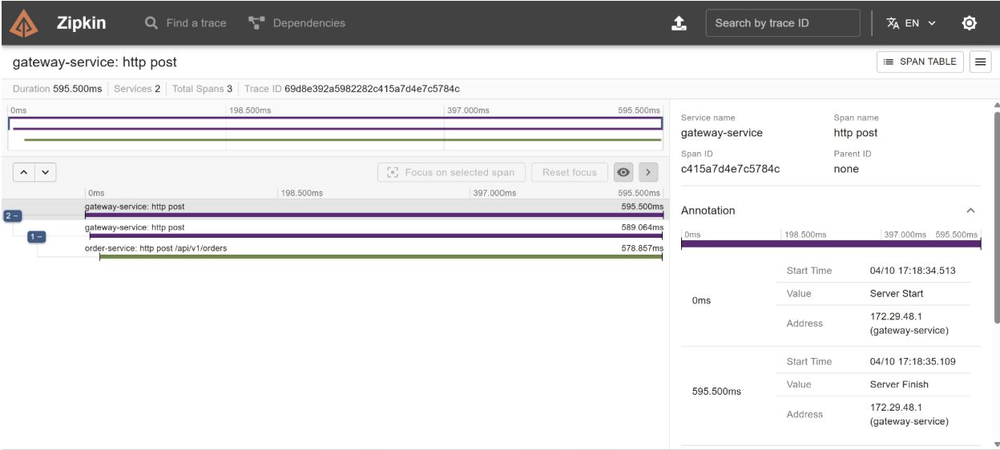

# 🛒 InfiCart — Event-Driven Microservices E-Commerce Backend

## 🧱 System Architecture (High-Level)


---

## 🔄 Event Flow & Communication

A production-grade **event-driven microservices system** built using Spring Boot, Kafka, PostgreSQL, MongoDB, and Zipkin.
This project demonstrates scalable backend architecture, asynchronous communication, and distributed observability.

---

# 📖 Table of Contents

* Architecture Overview
* System Components
* End-to-End Flow
* Failure Handling
* Data Model
* Engineering Decisions
* Observability (Zipkin)
* Running the Project
* API Examples
* Tradeoffs & Improvements

---

# 🏗️ Architecture Overview

```
Client → API Gateway
        ↓
   Order Service ─────────→ PostgreSQL
        ↓
     Kafka Topic
        ↓
 Notification Service → Email (MailDev)

Product Service → PostgreSQL  
Customer Service → MongoDB  

Infra:
- Config Server
- Eureka (Service Discovery)
- Zipkin (Tracing)
```

---

# 🧩 System Components

---

## 🌐 API Gateway

The **entry point** of the system.

* Routes incoming requests to appropriate services
* Hides internal service structure
* Enables centralized logging and tracing

---

## 👤 Customer Service

Manages customer data.

**Database:** MongoDB
**Reason:** Flexible schema for user profiles

Stores:

* Name
* Email
* Address

Used during order validation.

---

## 📦 Product Service

Handles product catalog and inventory.

**Database:** PostgreSQL

Stores:

* Product name
* Description
* Price
* Available quantity
* Category

Used by Order Service to validate product existence.

---

## 🧾 Order Service (Core Service)

The **central business logic layer**.

**Database:** PostgreSQL

Responsibilities:

* Validate customer
* Validate products
* Persist order
* Publish events to Kafka

---

## 💳 Payment Service

Handles payment confirmation.

Stores:

* Payment reference
* Amount
* Status

Publishes payment events to Kafka.

---

## 📨 Kafka (Message Broker)

The **asynchronous backbone** of the system.

* Decouples services
* Buffers events
* Enables fault tolerance

---

## 📧 Notification Service

Consumes Kafka events and sends emails.

* Listens for:

    * Order created
    * Payment completed
* Sends email using MailDev

---

## 🔍 Zipkin (Distributed Tracing)

Tracks requests across services.

* Shows request path
* Measures latency
* Helps debug failures

---

## ⚙️ Config Server

Centralized configuration management.

* Stores all configs in one place
* Avoids redeployment for config changes

---

## 📡 Eureka Server

Service discovery system.

* Services register themselves
* Enables dynamic communication

---

# 🔄 End-to-End Flow

---

## 🟢 Successful Order Flow

### Step 1 — Request enters system

```
Client → API Gateway → Order Service
```

---

### Step 2 — Validation

Order Service calls:

```
→ Product Service (check product exists)
→ Customer Service (check user exists)
```

---

### Step 3 — Persist Order

```
Order → stored in PostgreSQL
```

---

### Step 4 — Publish Event

```
Order Service → Kafka → "OrderCreatedEvent"
```

---

### Step 5 — Notification Processing

```
Notification Service → consumes event
```

---

### Step 6 — Email Delivery

```
Notification → MailDev → Email sent
```

---

### Step 7 — Observability

Zipkin records:

```
Gateway → Order → Product → Kafka → Notification
```

---

## 🔴 Failure Flow (Invalid Product)

```
Order Service → Product Service → FAIL
```

System behavior:

* ❌ No order saved
* ❌ No Kafka event
* ❌ No email

👉 Ensures **data consistency**

---

# 🧱 Data Model (Domain Understanding)

---

## Order Domain

* Order
* OrderLine (product + quantity)

---

## Product Domain

* Product
* Category

---

## Customer Domain

* Customer
* Address

---

## Payment Domain

* Payment

---

## Notification Domain

* Notification

---

# 🧠 Key Engineering Decisions

---

## ⚡ Why Kafka over REST?

REST approach:

```
Order → Notification (blocking)
```

Problems:

* Tight coupling
* Failure propagation
* Increased latency

Kafka approach:

```
Order → Kafka → Notification
```

Benefits:

* Decoupled services
* Async processing
* Fault tolerance
* Backpressure handling

👉 Order creation is independent of email delivery.

---

## 🗄️ Why Separate Databases?

Each service owns its data.

| Service      | DB         |
|--------------| ---------- |
| Customer     | MongoDB    |
| Notification | MongoDB    |
| Order        | PostgreSQL |
| Product      | PostgreSQL |
| Payment      | PostgreSQL |

Benefits:
* Loose coupling
* Independent scaling
* Technology flexibility
* No cross-service joins

---

## ⚙️ Why Config Server?

* Centralized configuration
* No rebuilds for config changes
* Environment-specific configs

---

## 🔍 Why Zipkin?

Without Zipkin:

* Logs are scattered
* Debugging is hard

With Zipkin:

* Full request trace
* Latency breakdown
* Bottleneck detection

---

## 📦 Why Flyway?

* Version-controlled migrations
* Schema consistency
* Safe DB evolution

---

# 🔍 Observability with Zipkin

Each request generates a **trace**.

Example:

```
Gateway (10ms)
→ Order Service (50ms)
→ Kafka (5ms)
→ Notification (30ms)
```

Concepts:

* Trace = full request
* Span = individual step

---

# 📸 System Snapshots

### Order Success



---

### Email Notifications




---

### Zipkin Trace



---

# 🧪 Sample API

```
POST /orders
```

```json
{
  "reference": "MS-001",
  "amount": 2200,
  "paymentMethod": "PAYPAL",
  "customerId": "69d8ce296ac4b365fabcc51d",
  "products": [
    { "productId": 10, "quantity": 1 },
    { "productId": 11, "quantity": 1 }
  ]
}
```

---

# 🚀 Running the Project

### Start infrastructure

```bash
docker compose up -d
```

---

### Run services

Start each Spring Boot service manually.

---

### Access tools

* Zipkin → http://localhost:9411
* MailDev → http://localhost:1080

---

# 🚀 Future Improvements

* Kafka retries + DLQ
* Circuit breaker (Resilience4j)
* JWT authentication
* Kubernetes deployment
* Rate limiting

---

# 🎯 Key Learnings

* Microservices architecture
* Event-driven systems
* Distributed tracing
* Service communication
* Fault-tolerant design

---

# 👨‍💻 Author

**Siddharth Rai**

*IIT Bhilai CSE '27*

---

